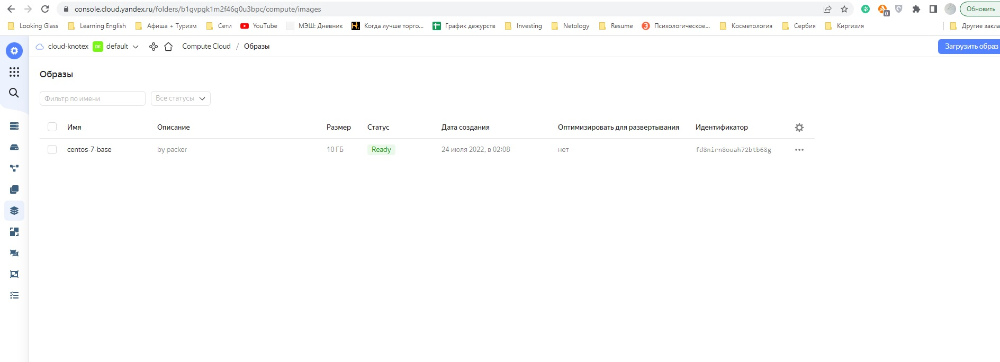
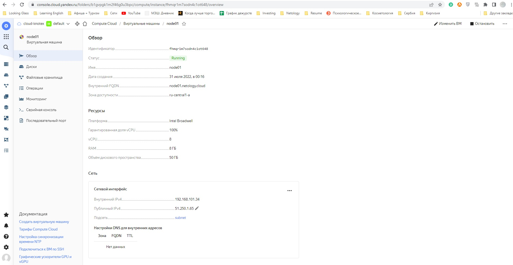
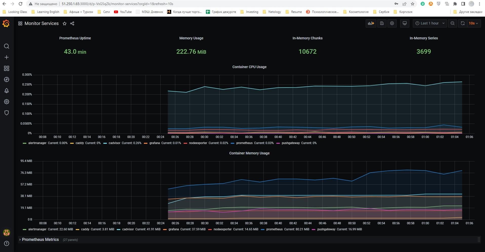

# Домашнее задание к занятию "5.4. Оркестрация группой Docker контейнеров на примере Docker Compose"

## Задача 1

Создать собственный образ операционной системы с помощью Packer.

Для получения зачета, вам необходимо предоставить:
- Скриншот страницы, как на слайде из презентации (слайд 37).

## Ответ

В презентации на слайде №37 информация о развертывании ПО и стека микросервисов в yandex cloud, либо я не туда смотрю-)
В любом случае, по контексту понимаю, что нужен скриншот с подтверждением создания образа. 
- Его и представляю ниже:

  

## Задача 2

Создать вашу первую виртуальную машину в Яндекс.Облаке.

Для получения зачета, вам необходимо предоставить:
- Скриншот страницы свойств созданной ВМ, как на примере ниже:

## Ответ

- Скриншот страницы свойств созданной ВМ:

  

## Задача 3

Создать ваш первый готовый к боевой эксплуатации компонент мониторинга, состоящий из стека микросервисов.

Для получения зачета, вам необходимо предоставить:
- Скриншот работающего веб-интерфейса Grafana с текущими метриками, как на примере ниже

## Ответ
- Скриншот работающего веб-интерфейса Grafana с текущими метриками:

  

