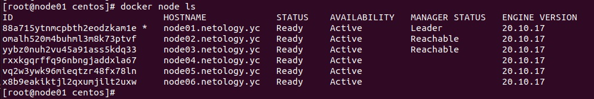
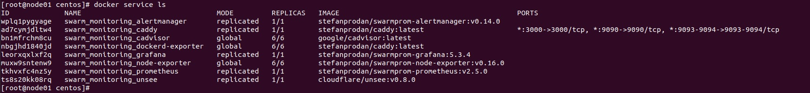

# Домашнее задание к занятию "5.5. Оркестрация кластером Docker контейнеров на примере Docker Swarm"

## Задача 1

Дайте письменые ответы на следующие вопросы:

- В чём отличие режимов работы сервисов в Docker Swarm кластере: replication и global?
- Какой алгоритм выбора лидера используется в Docker Swarm кластере?
- Что такое Overlay Network?

## Ответ

- В чём отличие режимов работы сервисов в Docker Swarm кластере: replication и global?

```
global mode - в этом режиме docker swarm запускает сервис на всех доступных ему нодах в единственном экземпляре.

replicated mode - в этом режиме manager устанавливает конкретное указанное администратором количество реплик сервиса. 
Соответсвенно, если указанное количество реплик меньше, чем колиство нод, то на части нод приложение 
будет установлено, а на оставшихся- нет.
```

- Какой алгоритм выбора лидера используется в Docker Swarm кластере?

```
Когда Docker Engine запускается в swarm mode, реализуется  Raft Consensus Algorithm для управления глобальным 
состоянием кластера.

Использование алгоритма позволяет нам быть уверенными в том, что все manager ноды кластера содержат согласованное 
состояние кластера.
Это означает, что в случае сбоя Leader Manager любая другая manager нода, ставшая Leader, способна восстановить 
стабильное состояние сервисов, перераспределив задачи между оставшимися нодами.

Raft алгоритм заключается в:

- Среди master нод выбирается leader - управляющая нода, синхронизирующая состояние кластера между всеми master нодами,
в результате все manager ноды содержат одинаковое согласованное состояние кластера.  
- Для того, чтобы остальные manager ноды понимали, что leader нода активна, она использует механизм keepalive- 
отсылает пакеты подтверждения. 
В случае отсутствия keepalive-пакета от leader ноды через заданый промежуток времени, остальные master ноды 
проводят процесс выбора нового leader.  
- Количество manager нод должно быть не менее 3 для того, чтобы обеспечить условие отказоустойчивости. 
- Количество manager нод должно быть нечетным- т.к. для согласования значений кластера необходимо подтверждение 
большинством master нод (кворум).
```

- Что такое Overlay Network?

```
Overlay network : Создает внутреннюю частную сеть, которая охватывает все узлы, участвующие в кластере swarm. 
Таким образом, оверлейные сети облегчают обмен данными между сервисом Docker Swarm и автономным контейнером 
или между двумя автономными контейнерами на разных демонах Docker.
```

## Задача 2

Создать ваш первый Docker Swarm кластер в Яндекс.Облаке

Для получения зачета, вам необходимо предоставить скриншот из терминала (консоли), с выводом команды:
```
docker node ls
```

## Ответ

<p align="center">
  
</p>


## Задача 3

Создать ваш первый, готовый к боевой эксплуатации кластер мониторинга, состоящий из стека микросервисов.

Для получения зачета, вам необходимо предоставить скриншот из терминала (консоли), с выводом команды:
```
docker service ls
```

## Ответ

<p align="center">
  
</p>


## Задача 4 (*)

Выполнить на лидере Docker Swarm кластера команду (указанную ниже) и дать письменное описание её функционала, что она делает и зачем она нужна:
```
# см.документацию: https://docs.docker.com/engine/swarm/swarm_manager_locking/
docker swarm update --autolock=true
```
## Ответ
```
Когда демон Docker перезапускается, ключ TLS, используемый для шифрования связи между нодами swarm, 
и ключ, используемый для шифрования и расшифровки журналов Raft на диске, загружаются в память 
каждой manager node. 
Docker позволяет нам защитить эти ключи, позволяя нам стать их владельцами и потребовать от нас 
вручную разблокировать узлы manager node при запуске. Это функция- docker swarm autolock feature. 
Таким образом, после перезапуска docker swarm, нам в начале необходимо подтвердить наши права, 
введя сгенерированный этой фитчей ключ шифрования.
Фитчу можно подключить при инициализации нового swarm командой:
 docker swarm init --autolock
Можно запустить в процессе эксплуатации сущестыующего docker swarm:
 docker swarm update --autolock=true
Далее для разблокировки ввести ключ:
 docker swarm unlock-key
Для отключения фитчи используем:
 docker swarm update --autolock=false
Просмотр текущего ключа:
 docker swarm unlock-key
В целях безопасности рекомендуется регулярно изменять ключи, используя команду:
 docker swarm unlock-key --rotate
```

---

### Как cдавать задание

Выполненное домашнее задание пришлите ссылкой на .md-файл в вашем репозитории.

---
